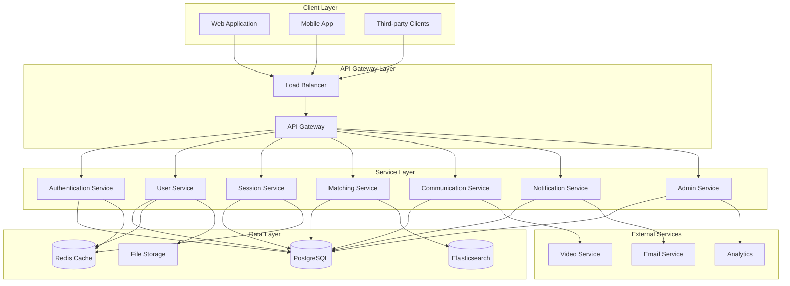

# Design Document: Mentor Matching Platform

## Overview

This design transforms the existing Java Swing mentor matching desktop application into a modern, production-ready web platform. The architecture follows microservices patterns with a focus on scalability, security, and real-time user experience. The system will support thousands of concurrent users while maintaining sub-200ms response times for standard operations.

The platform adopts a cloud-native approach with containerized services, API-first design, and event-driven architecture to enable real-time features like messaging and notifications. Security is implemented through OAuth2/JWT authentication with role-based access control.

## Architecture

### High-Level Architecture

The system follows a microservices architecture pattern with the following key components:



### Service Architecture Patterns

**API Gateway Pattern**: A single entry point ([source](https://softwarepatternslexicon.com/java/microservices-design-patterns/api-gateway-pattern/)) that handles cross-cutting concerns including authentication, rate limiting, and request routing. The gateway aggregates responses from multiple services and provides a unified interface to clients.

**Backend for Frontend (BFF)**: Separate API compositions for web and mobile clients to optimize data transfer and user experience for each platform type.

**Event-Driven Architecture**: Services communicate through asynchronous events for real-time features, using message queues for reliable delivery and decoupling.

## Components and Interfaces

### Authentication Service

**Responsibilities:**
- User registration and login
- JWT token generation and validation
- OAuth2 integration for social login
- Multi-factor authentication
- Password reset and security policies

**Key Interfaces:**
```typescript
interface AuthenticationService {
  register(userData: UserRegistration): Promise<AuthResult>
  login(credentials: LoginCredentials): Promise<AuthResult>
  validateToken(token: string): Promise<TokenValidation>
  refreshToken(refreshToken: string): Promise<AuthResult>
  enableMFA(userId: string, method: MFAMethod): Promise<MFASetup>
}

interface AuthResult {
  accessToken: string
  refreshToken: string
  expiresIn: number
  user: UserProfile
}
```

### User Service

**Responsibilities:**
- User profile management
- Role and permission management
- Profile image handling
- Privacy settings
- User search and discovery

**Key Interfaces:**
```typescript
interface UserService {
  createProfile(userId: string, profile: ProfileData): Promise<UserProfile>
  updateProfile(userId: string, updates: ProfileUpdates): Promise<UserProfile>
  getProfile(userId: string): Promise<UserProfile>
  searchUsers(criteria: SearchCriteria): Promise<UserProfile[]>
  uploadProfileImage(userId: string, image: File): Promise<ImageUploadResult>
}

interface UserProfile {
  id: string
  email: string
  role: UserRole
  profile: MentorProfile | StudentProfile
  preferences: UserPreferences
  createdAt: Date
  updatedAt: Date
}
```

### Session Service

**Responsibilities:**
- Session creation and management
- Capacity and availability tracking
- Registration and waitlist management
- Session scheduling and conflicts
- Session history and analytics

**Key Interfaces:**
```typescript
interface SessionService {
  createSession(mentorId: string, session: SessionData): Promise<Session>
  updateSession(sessionId: string, updates: SessionUpdates): Promise<Session>
  registerForSession(sessionId: string, studentId: string): Promise<RegistrationResult>
  getAvailableSessions(filters: SessionFilters): Promise<Session[]>
  getMentorSessions(mentorId: string): Promise<Session[]>
  getStudentSessions(studentId: string): Promise<Session[]>
}

interface Session {
  id: string
  mentorId: string
  title: string
  description: string
  expertiseAreas: string[]
  scheduledAt: Date
  duration: number
  capacity: number
  registeredStudents: string[]
  waitlist: string[]
  status: SessionStatus
}
```

### Matching Service

**Responsibilities:**
- Intelligent session recommendations
- Compatibility scoring algorithms
- Learning from user feedback
- Preference-based filtering
- Search and discovery optimization

**Key Interfaces:**
```typescript
interface MatchingService {
  getRecommendations(studentId: string, limit: number): Promise<SessionRecommendation[]>
  searchSessions(query: SearchQuery): Promise<SearchResult[]>
  recordFeedback(studentId: string, sessionId: string, feedback: MatchingFeedback): Promise<void>
  updatePreferences(userId: string, preferences: MatchingPreferences): Promise<void>
}

interface SessionRecommendation {
  session: Session
  compatibilityScore: number
  reasons: string[]
  mentor: MentorProfile
}
```

### Communication Service

**Responsibilities:**
- Real-time messaging between users
- Message history and search
- Video call integration
- File sharing in conversations
- Message delivery and read receipts

**Key Interfaces:**
```typescript
interface CommunicationService {
  sendMessage(fromUserId: string, toUserId: string, message: MessageData): Promise<Message>
  getConversation(userId1: string, userId2: string): Promise<Conversation>
  searchMessages(userId: string, query: string): Promise<Message[]>
  initiateVideoCall(fromUserId: string, toUserId: string): Promise<VideoCallSession>
  markAsRead(userId: string, messageId: string): Promise<void>
}

interface Message {
  id: string
  fromUserId: string
  toUserId: string
  content: string
  type: MessageType
  timestamp: Date
  readAt?: Date
}
```

### Notification Service

**Responsibilities:**
- Multi-channel notification delivery
- User preference management
- Notification templates and personalization
- Delivery tracking and retry logic
- Digest and summary notifications

**Key Interfaces:**
```typescript
interface NotificationService {
  sendNotification(userId: string, notification: NotificationData): Promise<void>
  sendBulkNotifications(notifications: BulkNotificationData[]): Promise<void>
  updatePreferences(userId: string, preferences: NotificationPreferences): Promise<void>
  getNotificationHistory(userId: string): Promise<Notification[]>
  markAsRead(userId: string, notificationId: string): Promise<void>
}

interface NotificationData {
  type: NotificationType
  title: string
  message: string
  channels: NotificationChannel[]
  priority: NotificationPriority
  metadata?: Record<string, any>
}
```

## Data Models

### Core Entity Models

**User Entity:**
```typescript
interface User {
  id: string
  email: string
  passwordHash: string
  role: 'MENTOR' | 'STUDENT' | 'ADMIN'
  emailVerified: boolean
  mfaEnabled: boolean
  createdAt: Date
  updatedAt: Date
  lastLoginAt?: Date
}
```

**Profile Entities:**
```typescript
interface MentorProfile {
  userId: string
  firstName: string
  lastName: string
  bio: string
  expertiseAreas: string[]
  yearsOfExperience: number
  hourlyRate?: number
  availability: AvailabilitySlot[]
  profileImageUrl?: string
  socialLinks: SocialLink[]
  rating: number
  totalSessions: number
}

interface StudentProfile {
  userId: string
  firstName: string
  lastName: string
  bio: string
  learningGoals: string[]
  interests: string[]
  currentLevel: SkillLevel
  profileImageUrl?: string
  preferredSessionTypes: SessionType[]
}
```

**Session Entity:**
```typescript
interface Session {
  id: string
  mentorId: string
  title: string
  description: string
  expertiseAreas: string[]
  sessionType: 'ONE_ON_ONE' | 'GROUP' | 'WORKSHOP'
  scheduledAt: Date
  duration: number // minutes
  capacity: number
  currentRegistrations: number
  registeredStudents: SessionRegistration[]
  waitlist: WaitlistEntry[]
  status: 'SCHEDULED' | 'IN_PROGRESS' | 'COMPLETED' | 'CANCELLED'
  meetingLink?: string
  materials: SessionMaterial[]
  createdAt: Date
  updatedAt: Date
}
```

**Communication Entities:**
```typescript
interface Conversation {
  id: string
  participants: string[]
  lastMessage?: Message
  createdAt: Date
  updatedAt: Date
}

interface Message {
  id: string
  conversationId: string
  fromUserId: string
  content: string
  type: 'TEXT' | 'FILE' | 'IMAGE' | 'SYSTEM'
  metadata?: Record<string, any>
  createdAt: Date
  editedAt?: Date
}
```

### Database Schema Design

**PostgreSQL Tables:**
- Users, MentorProfiles, StudentProfiles
- Sessions, SessionRegistrations, WaitlistEntries
- Conversations, Messages
- Notifications, NotificationPreferences
- Reviews, Ratings
- AuditLogs

**Redis Cache Structure:**
- User sessions: `session:{userId}` (JWT validation cache)
- Active conversations: `conversation:{conversationId}` (real-time messaging)
- Session availability: `availability:{mentorId}` (quick lookup)
- Notification queues: `notifications:{userId}` (pending notifications)

**Elasticsearch Indices:**
- Sessions index: Optimized for search and filtering
- Users index: Profile search and matching
- Messages index: Conversation search and history

## Correctness Properties

*A property is a characteristic or behavior that should hold true across all valid executions of a system—essentially, a formal statement about what the system should do. Properties serve as the bridge between human-readable specifications and machine-verifiable correctness guarantees.*

Based on the prework analysis of acceptance criteria, the following properties capture the essential correctness behaviors of the mentor matching platform:

### Authentication and Security Properties

**Property 1: Authentication behavior consistency**
*For any* user registration with valid credentials, the Authentication_Service should create an account, send email verification, and allow subsequent login with those credentials
**Validates: Requirements 1.1, 1.2**

**Property 2: Invalid authentication rejection**
*For any* invalid login credentials, the Authentication_Service should reject the attempt and log a security event without creating a session
**Validates: Requirements 1.3**

**Property 3: Role-based access control**
*For any* authenticated user and role-specific feature, the Platform should verify permissions before granting access, allowing access only when the user's role has appropriate permissions
**Validates: Requirements 1.4**

**Property 4: Multi-factor authentication enforcement**
*For any* user with MFA enabled, the Authentication_Service should require additional verification before completing login
**Validates: Requirements 1.5**

**Property 5: Data encryption consistency**
*For any* sensitive data stored or transmitted, the Platform should encrypt it using industry-standard encryption methods
**Validates: Requirements 10.1**

### Profile and User Management Properties

**Property 6: Profile creation and validation**
*For any* valid profile data (mentor or student), the Platform should validate it against defined schemas, store it correctly, and make it retrievable
**Validates: Requirements 3.1, 3.2, 3.3**

**Property 7: Image processing consistency**
*For any* uploaded profile image, the Platform should resize, optimize, and store it securely while maintaining image integrity
**Validates: Requirements 3.4**

**Property 8: Privacy settings enforcement**
*For any* user privacy setting configuration, the Platform should enforce visibility controls consistently across all profile access points
**Validates: Requirements 3.5**

### Session Management Properties

**Property 9: Session creation and storage**
*For any* valid session data from a mentor, the Platform should validate, categorize, and store the session correctly
**Validates: Requirements 4.1**

**Property 10: Recurring session generation**
*For any* recurring session pattern, the Platform should generate individual session instances with correct scheduling and no conflicts
**Validates: Requirements 4.2**

**Property 11: Double-booking prevention**
*For any* session creation attempt, the Platform should check mentor availability and prevent overlapping sessions
**Validates: Requirements 4.3**

**Property 12: Capacity management**
*For any* session that reaches capacity, the Platform should close registration and maintain an accurate waitlist
**Validates: Requirements 4.4**

### Matching and Recommendation Properties

**Property 13: Session ranking consistency**
*For any* student profile and available sessions, the Matching_Engine should rank sessions based on compatibility, learning goals, and preferences consistently
**Validates: Requirements 5.1**

**Property 14: Historical influence on recommendations**
*For any* student with session history, the Matching_Engine should incorporate past sessions when generating new recommendations
**Validates: Requirements 5.2**

**Property 15: Matching criteria application**
*For any* matching operation, the Platform should factor in mentor ratings, expertise alignment, and timing preferences consistently
**Validates: Requirements 5.3**

### Communication Properties

**Property 16: Message delivery consistency**
*For any* message sent between users, the Real_Time_Service should deliver it to online recipients immediately and store it for offline recipients
**Validates: Requirements 6.1, 6.2**

**Property 17: Message history and search**
*For any* conversation, the Platform should maintain complete message history and provide accurate search results
**Validates: Requirements 6.5**

**Property 18: Video call integration**
*For any* session requiring video calling, the Platform should successfully initiate and manage video call sessions
**Validates: Requirements 6.3**

### Notification Properties

**Property 19: Notification delivery through preferred channels**
*For any* notification event and user preferences, the Notification_System should deliver notifications through the user's preferred channels
**Validates: Requirements 8.1**

**Property 20: Session reminder timing**
*For any* upcoming session, the Notification_System should send reminder notifications at configured intervals to all participants
**Validates: Requirements 8.3, 6.4**

**Property 21: Notification failure handling**
*For any* notification delivery failure, the Notification_System should retry appropriately and handle failures gracefully
**Validates: Requirements 8.5**

### Rating and Review Properties

**Property 22: Post-session rating prompts**
*For any* completed session, the Platform should prompt all participants to provide ratings and feedback
**Validates: Requirements 7.1**

**Property 23: Rating calculation accuracy**
*For any* mentor with reviews, the Platform should calculate and display accurate average ratings based on all received reviews
**Validates: Requirements 7.2**

**Property 24: Review validation and association**
*For any* submitted review, the Platform should validate the content and correctly associate it with the corresponding session
**Validates: Requirements 7.3**

### Performance and API Properties

**Property 25: Response time consistency**
*For any* standard API operation under normal load, the Platform should respond within 200ms
**Validates: Requirements 2.4, 11.1**

**Property 26: API specification compliance**
*For any* API endpoint, it should follow RESTful principles and OpenAPI specification standards
**Validates: Requirements 2.3, 12.1, 12.4**

**Property 27: API security enforcement**
*For any* external API request, the API_Gateway should authenticate, authorize, and apply rate limiting appropriately
**Validates: Requirements 12.2**

**Property 28: Caching effectiveness**
*For any* cached operation, the Platform should reduce database load and improve response times compared to non-cached operations
**Validates: Requirements 11.5**

### Administrative Properties

**Property 29: Administrative action logging**
*For any* administrative action, the Platform should create accurate audit logs for compliance and security purposes
**Validates: Requirements 9.5**

**Property 30: System monitoring and alerting**
*For any* detected system issue, the Platform should alert administrators and provide appropriate diagnostic information
**Validates: Requirements 9.4**

<function_calls>
<invoke name="prework">
<parameter name="featureName">mentor-matching-platform

## Error Handling

### Error Classification and Response Strategy

**Authentication Errors:**
- Invalid credentials: Return 401 with generic error message to prevent user enumeration
- Expired tokens: Return 401 with refresh token guidance
- MFA failures: Return 401 with specific MFA error codes
- Rate limiting: Return 429 with retry-after headers

**Validation Errors:**
- Input validation: Return 400 with detailed field-level error messages
- Business rule violations: Return 422 with specific business context
- File upload errors: Return 413 for size limits, 415 for unsupported formats

**Resource Errors:**
- Not found: Return 404 with generic message to prevent information disclosure
- Conflict: Return 409 for double-booking or duplicate resources
- Capacity exceeded: Return 409 with waitlist information

**System Errors:**
- Database failures: Return 503 with retry guidance, log detailed errors internally
- External service failures: Return 502 with fallback options when available
- Rate limiting: Return 429 with exponential backoff recommendations

### Real-Time Communication Error Handling

**WebSocket Connection Management:**
- Automatic reconnection with exponential backoff
- Message queuing during disconnection periods
- Graceful degradation to polling for persistent connection issues
- Connection state synchronization on reconnect

**Message Delivery Guarantees:**
- At-least-once delivery for critical notifications
- Duplicate detection and deduplication
- Offline message storage with configurable retention
- Delivery confirmation and retry mechanisms

### Resilience Patterns

**Circuit Breaker Pattern:**
- Implement circuit breakers for external service calls
- Configurable failure thresholds and recovery timeouts
- Fallback mechanisms for degraded functionality
- Health check endpoints for monitoring

**Retry and Timeout Strategies:**
- Exponential backoff for transient failures
- Configurable timeout values per operation type
- Maximum retry limits to prevent infinite loops
- Jitter addition to prevent thundering herd effects

## Testing Strategy

### Dual Testing Approach

The platform requires both unit testing and property-based testing to ensure comprehensive coverage:

**Unit Tests:**
- Focus on specific examples, edge cases, and error conditions
- Test integration points between services
- Validate specific business logic scenarios
- Cover error handling and boundary conditions

**Property-Based Tests:**
- Verify universal properties across all inputs through randomization
- Test system behavior with generated data sets
- Validate correctness properties defined in this design
- Ensure comprehensive input coverage

### Property-Based Testing Configuration

**Framework Selection:**
- **Java**: Use QuickCheck for Java or jqwik for property-based testing
- **TypeScript/JavaScript**: Use fast-check for comprehensive property testing
- **Python**: Use Hypothesis for advanced property-based testing strategies

**Test Configuration Requirements:**
- Minimum 100 iterations per property test (due to randomization)
- Each property test must reference its corresponding design document property
- Tag format: **Feature: mentor-matching-platform, Property {number}: {property_text}**
- Each correctness property must be implemented by a single property-based test

**Property Test Implementation Guidelines:**
- Generate realistic test data that matches production patterns
- Include edge cases in generators (empty lists, boundary values, special characters)
- Use shrinking to find minimal failing examples
- Combine multiple properties in comprehensive test suites

### Integration Testing Strategy

**API Integration Tests:**
- End-to-end API workflow testing
- Authentication and authorization flow validation
- Cross-service communication verification
- Performance benchmarking under load

**Real-Time Feature Testing:**
- WebSocket connection lifecycle testing
- Message delivery and ordering verification
- Concurrent user simulation
- Network partition and recovery testing

**Database Integration Tests:**
- Transaction isolation and consistency verification
- Concurrent access pattern testing
- Data migration and schema evolution testing
- Performance testing with realistic data volumes

### Performance Testing Requirements

**Load Testing Scenarios:**
- Normal load: 1000 concurrent users
- Peak load: 5000 concurrent users
- Stress testing: 10000+ concurrent users
- Endurance testing: 24-hour sustained load

**Performance Benchmarks:**
- API response times: <200ms for 95th percentile
- Database query performance: <100ms for standard operations
- Real-time message delivery: <50ms end-to-end latency
- File upload processing: <5 seconds for standard image sizes

**Monitoring and Observability:**
- Application performance monitoring (APM) integration
- Distributed tracing for request flow analysis
- Custom metrics for business logic performance
- Alerting thresholds for performance degradation

This comprehensive testing strategy ensures that the mentor matching platform maintains high quality, performance, and reliability standards while supporting rapid development and deployment cycles.