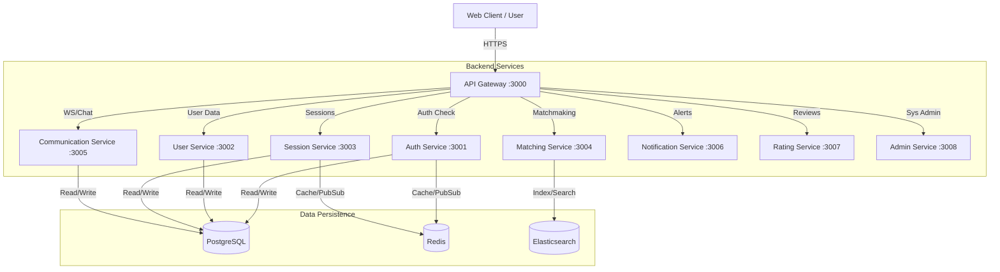

# Mentor Matching Platform
>
> **A Scalable, Cloud-Native Solution for Professional Mentorship Connections**

<div align="center">

[](https://nodejs.org/)
[](https://www.typescriptlang.org/)
[](https://reactjs.org/)
[](https://www.docker.com/)
[](https://www.postgresql.org/)
[](https://redis.io/)
[](LICENSE)

</div>

---

## 🚀 The Elevator Pitch

The **Mentor Matching Platform** modernizes professional development by replacing legacy desktop systems with a high-performance **Microservices Architecture**. It enables seamless connections between Mentors and Students through **Real-time Video/Chat**, **Intelligent Matching Algorithms**, and **Secure Scheduling**. Built for scale, it handles thousands of concurrent sessions with robust Observability and RBAC security.

---

## 🏗️ Visual Architecture

The system uses a **Backend-for-Frontend (BFF)** pattern where a central **API Gateway** manages traffic to specialized microservices, ensuring a decoupled and resilient infrastructure.



### Modular Design

This project is a **Turborepo Monorepo**, dividing the codebase into:

- **Apps**: Consumer-facing frontends (React).
- **Packages**: Independent backend microservices and shared logic libraries.
- **Infrastructure**: Docker orchestration and Database schemas.

---

## ✨ Key Features

- **🔐 Enterprise Security**: Role-Based Access Control (RBAC) and Multi-Factor Authentication (MFA).
- **📅 Session Management**: Availability blocks, recurring sessions, and waitlist queues.
- **💬 Real-Time Interaction**: Integrated WebRTC signaling and Socket.IO chat rooms.
- **🧠 Smart Matching**: Elasticsearch-powered recommendations connecting students to the right experts.
- **📢 Multi-Channel Notifications**: Centralized dispatch for Email, SMS, and Push alerts.
- **📈 Observability**: Pre-configured stacks for Prometheus, Grafana, and Loki logging.

---

## 📂 Project Structure

```bash
root/
├── apps/
│   └── web-app/             # 📱 Main React Client (Vite + MUI + Redux)
├── packages/
│   ├── api-gateway/         # 🚪 BFF Entry Point & Rate Limiter
│   ├── auth-service/        # 🛡️ Identity, JWT, & MFA Provider
│   ├── user-service/        # 👤 Profile & Availability Management
│   ├── session-service/     # 📅 Booking & Scheduling Engine
│   ├── matching-service/    # 🧠 Elasticsearch Recommendation Engine
│   ├── communication-service/ # 💬 Socket.IO & WebRTC Signaling
│   ├── notification-service/ # 🔔 Email/SMS Dispatcher
│   ├── rating-service/      # ⭐ Feedback & Analytics
│   ├── admin-service/       # 👮 Back-office Management
│   └── shared/              # 📦 Common Types, Middleware & Utils
├── database/                # 💾 SQL Migrations & Seed Data
├── monitoring/              # 📊 Prometheus, Grafana & Loki Configs
└── scripts/                 # 🛠️ DevOps Automation (Deploy/Backup)
```

> **Note**: Each folder contains its own detailed `README.md` explaining its specific responsibilities and usage.

---

## 🏎️ Getting Started

### Prerequisites

- **Node.js** v18+
- **Docker Desktop** (running)
- **NPM** v9+

### Quick Start

Clone the repo and launch the entire stack with one command:

```bash
# 1. Clone the repository
git clone https://github.com/organization/mentor-matching-platform.git
cd mentor-matching-platform

# 2. Install dependencies (Root)
npm install

# 3. Setup local environment variables
cp .env.example .env

# 4. Launch Infrastructure & Services (Docker)
npm run docker:up

# The Web App will be live at: http://localhost:3001
# The API Gateway will be live at: http://localhost:3000
```

<details>
<summary><strong>Troubleshooting? Click here</strong></summary>

- **Ports**: Ensure ports `3000-3008`, `5432` (Postgres), and `6379` (Redis) are free.
- **Seed Data**: If the DB is empty, run `npm run db:seed` to populate test users.
- **Logs**: View service logs with `docker-compose logs -f [service_name]`.

</details>

---

## ☁️ Deployment

The project uses a containerized deployment strategy managed by **Docker Compose**.

- **Deployment Script**: `scripts/deploy.sh` handles building, migrating, and restarting services.
- **Environments**: Supports `development`, `staging`, and `production` via environment variable injection.

```bash
# Deploy to Staging
./scripts/deploy.sh staging
```

For detailed infrastructure diagrams, see [docs/04_DEPLOYMENT_AND_INFRA.md](docs/04_DEPLOYMENT_AND_INFRA.md).

---

<div align="center">
    <sub>Built with ❤️ by Me</sub>
</div>
