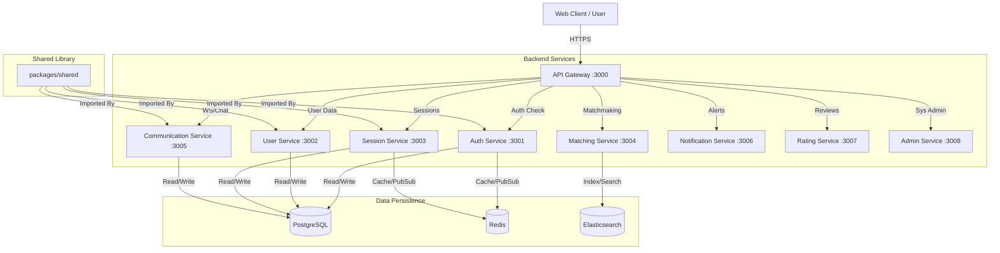

# 01. Project Overview & Architecture

## 1. Project Purpose

The **Mentor Matching Platform** is a production-grade, microservices-based web application designed to facilitate professional mentorship connections. It transforms a legacy desktop application into a scalable, cloud-native solution. Users can register as Mentors or Students, schedule sessions, communicate via real-time chat/video, and track learning progress.

The system emphasizes **scalability**, **security** (RBAC, MFA), and **observability**.

## 2. Technology Stack

### Core Runtime & Languages

- **Runtime**: Node.js (v18+)
- **Language**: TypeScript (v5+)
- **Monorepo Manager**: Turborepo
- **Package Manager**: NPM Workspaces

### Backend Services

- **Framework**: Express.js
- **Communication**: REST API (Inter-service via HTTP/Gateway) & Socket.IO (Real-time)
- **Database**: PostgreSQL (Primary Relational Data)
- **Caching**: Redis (Sessions, Caching)
- **Search**: Elasticsearch (Matching Engine)

### Frontend

- **Framework**: React.js (Vite)
- **State Management**: Redux Toolkit
- **UI Library**: Material UI (MUI)

### Infrastructure & DevOps

- **Containerization**: Docker & Docker Compose
- **Orchestration**: Docker Swarm (compatible) / Kubernetes ready
- **Gateway/Proxy**: Nginx & Custom Node.js Gateway
- **Monitoring**: Prometheus, Grafana, Loki
- **CI/CD**: GitHub Actions (implied by `.github` folder)

## 3. High-Level Architecture

The platform follows a **Microservices Architecture** pattern, utilizing a Backend-for-Frontend (BFF) approach via the API Gateway. All external traffic flows through the Gateway, which handles routing, authentication (validating tokens via Auth Service), and rate limiting.

## 4. Directory Structure Breakdown

The project follows a standard monorepo structure managed by Turborepo.

### Root Directories

| Directory | Description |
|-----------|-------------|
| `apps/` | Contains user-facing applications (Frontend). |
| `packages/` | Contains backend microservices and shared libraries. |
| `database/` | SQL migration scripts and seed data logic. |
| `monitoring/` | Configuration for Prometheus, Grafana, and Loki containers. |
| `scripts/` | Shell/PowerShell utilities for deployment, migration, and rollback. |
| `docs/` | Project documentation (Archived and Generated). |
| `nginx/` | Nginx configuration for load balancing/reverse proxy. |

### Apps & Packages Detail

#### `apps/`

- **`web-app`**: The primary React frontend application.

#### `packages/`

- **`api-gateway`**: Entry point, routing, and shared middlewares.
- **`auth-service`**: JWT handling, Login/Register, MFA, RBAC.
- **`user-service`**: Profiles, Availability, Privacy settings.
- **`session-service`**: Session CRUD, Booking logic.
- **`matching-service`**: Algorithms for connecting mentors/students.
- **`communication-service`**: Chat and Video logic (Socket.IO).
- **`notification-service`**: Email/SMS/Push dispatchers.
- **`rating-service`**: Feedback compilation and scoring.
- **`admin-service`**: Back-office management tools.
- **`shared`**: Common Types, Utilities, Constants, and Middlewares shared across all services.

## 5. Key Dependencies

- **`turbo`**: Orchestrates build, test, and lint tasks across the workspace.
- **`typescript`**: Enforces type safety across the entire stack.
- **`docker-compose`**: Defines the local development environment ensuring all services, databases, and message brokers spin up in orchestration.
