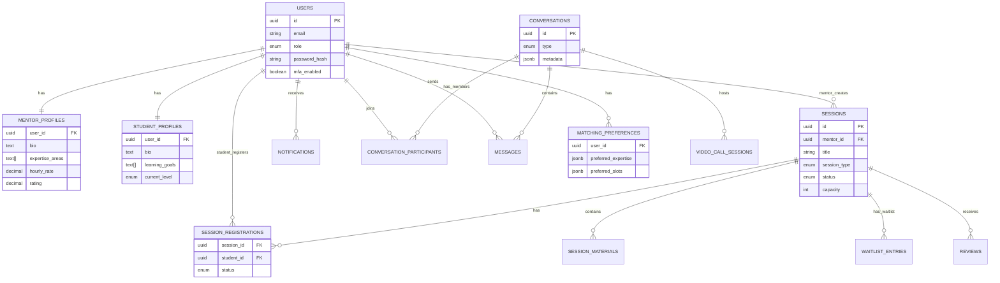

# 02. Database Schema & Data Models

## 1. Overview

The Mentor Matching Platform uses a **PostgreSQL** relational database for primary data storage. The schema uses **UUIDs** for all primary keys and enforces data integrity via Foreign Key relationships and constraints.

**Key Features:**

- **UUIDs**: Used everywhere for ID obfuscation and collision avoidance.
- **RBAC**: Enforced via `user_role` enums.
- **Polymorphism**: Separation of `mentor_profiles` and `student_profiles`.
- **JSONB**: Used for flexible preferences/metadata (e.g., `expertise_areas`, `metadata`).

## 2. Entity Relationship Diagram (ERD)

## 3. Core Tables Breakdown

### User Management

| Table | Description | Key Relationships |
|-------|-------------|-------------------|
| `users` | Core identity table. Contains AuthN data and Role. | Parent of all user data. |
| `mentor_profiles` | Additional data for Mentors (Bio, Rate, Experience). | One-to-One with `users`. |
| `student_profiles` | Additional data for Students (Goals, Level). | One-to-One with `users`. |
| `availability_slots` | Time slots when a mentor is available. | Many-to-One with `users`(Mentor). |

### Session Management

| Table | Description | Key Relationships |
|-------|-------------|-------------------|
| `sessions` | The core "product". Represents a scheduled mentorship event. | Owned by `users`(Mentor). |
| `session_registrations` | Junction table tracking who booked which session. | Link between `sessions` and `users`. |
| `waitlist_entries` | Overflow queue for full sessions. | Link between `sessions` and `users`. |
| `session_materials` | Resources (PDF/Link) attached to a session. | Many-to-One with `sessions`. |

### Communication

| Table | Description | Key Relationships |
|-------|-------------|-------------------|
| `conversations` | A chat room (Direct or Group). | Parent of participants/messages. |
| `messages` | Individual chat messages. | Many-to-One with `conversations` & `users`. |
| `video_call_sessions` | Metadata for live video calls (Room IDs, Duration). | Linked to `conversations`. |

### Matching & Intelligence

| Table | Description | Key Relationships |
|-------|-------------|-------------------|
| `matching_preferences` | User settings for the matching algorithm. | One-to-One with `users`. |
| `matching_feedback` | Post-match feedback to improve the algorithm. | Linked to `sessions` and `users`. |
| `reviews` | Public ratings and text reviews for sessions. | Linked to `sessions` and `users`. |

### Infrastructure

| Table | Description | Key Relationships |
|-------|-------------|-------------------|
| `notifications` | System alerts/emails sent to users. | Linked to `users`. |
| `audit_logs` | Security and action tracking log. | Linked to `users` (optional). |

## 4. Design Patterns & Constraints

- **Cascade Deletes**: Most Foreign Keys use `ON DELETE CASCADE`. If a User is deleted, their Profile, Messages, and Registrations vanish.
- **Enums**: Heavily used for status/types (`session_status`, `user_role`) ensures strict data validation at the DB level.
- **JSONB**: Used for `metadata` and complex preferences to allow schema flexibility without migrations.
- **Timestamps**: All tables track `created_at` and `updated_at`, managed by DB triggers.
