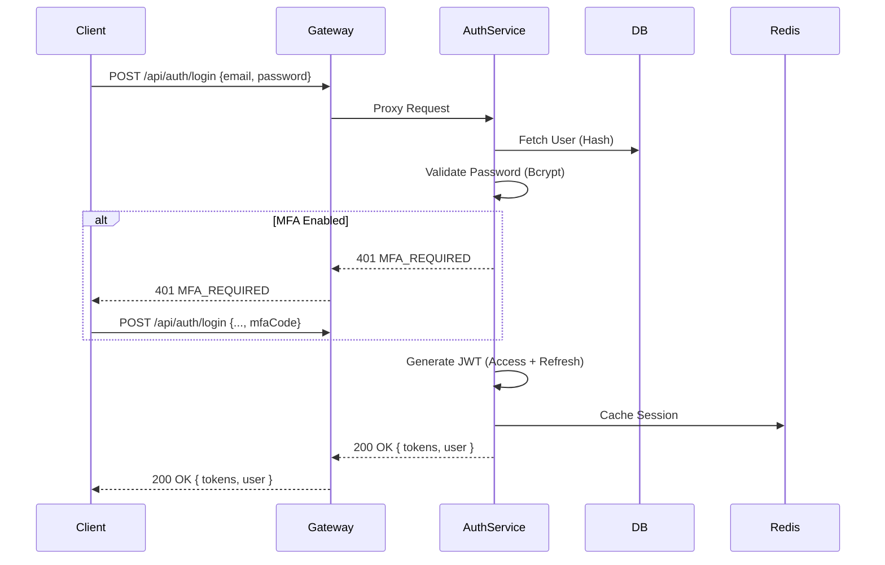
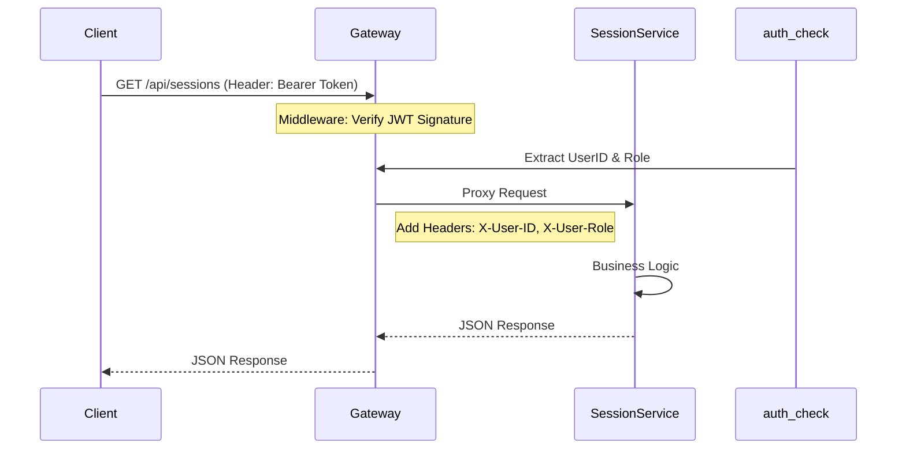

# 03. Backend Services & API Documentation

## 1. System Overview

The backend consists of **9 Microservices** and a **Backend-for-Frontend (BFF) API Gateway**. All client communication goes through the Gateway (Port 3000), which proxies requests to the appropriate internal service.

| Service | Internal URL | Public Path | Description |
|---------|--------------|-------------|-------------|
| **API Gateway** | `localhost:3000` | `/api` | Entry point, Auth check, Rate limiting. |
| **Auth Service** | `localhost:3001` | `/api/auth` | User identity, JWT, MFA, RBAC. |
| **User Service** | `localhost:3002` | `/api/users` | Profiles, Social links, Availability. |
| **Session Service** | `localhost:3003` | `/api/sessions`| Session CRUD, Booking, Waitlist. |
| **Matching Service**| `localhost:3004` | `/api/matching`| Algorithms for mentor/student matching. |
| **Comm Service** | `localhost:3005` | `/api/communication` | Chat History, Video Call Meta. |
| **Notify Service** | `localhost:3006` | `/api/notifications` | Email/Push preferences. |
| **Rating Service** | `localhost:3007` | - | Feedback aggregation (Internal). |
| **Admin Service** | `localhost:3008` | `/api/admin` | Back-office logic. |

## 2. Critical User Flows

### 2.1 User Login & Token Generation

### 2.2 Authenticated Request Proxying

## 3. Core API Endpoints

### Authentication Service (`/api/auth`)

| Method | Endpoint | logic |
|:------:|----------|-------|
| `POST` | `/register` | Create account, trigger email verification. |
| `POST` | `/login` | Validate creds, return JWT pair. |
| `POST` | `/refresh` | Get new Access Token using Refresh Token. |
| `POST` | `/mfa/setup` | Init MFA, return QR Code/Secret. |
| `POST` | `/mfa/enable` | Verify TOTP code to activate MFA. |
| `GET`  | `/me` | Get current user context (profile wrapper). |
| `GET`  | `/users` | **[Admin]** List all users with pagination. |

### Session Service (`/api/sessions`)

| Method | Endpoint | Logic |
|:------:|----------|-------|
| `GET`  | `/` | List sessions with filters (date, topic). |
| `POST` | `/` | **[Mentor]** Create a new session. |
| `GET`  | `/:id` | Get session details. |
| `POST` | `/:id/join` | **[Student]** Register for a session. |
| `DELETE`| `/:id/join` | **[Student]** Cancel registration. |
| `POST` | `/:id/waitlist`| Join waitlist if full. |

### User Service (`/api/users`)

| Method | Endpoint | Logic |
|:------:|----------|-------|
| `GET`  | `/profile/:id` | Public profile view. |
| `PUT`  | `/profile` | Update own profile (Bio, Skills). |
| `GET`  | `/availability`| Get Mentor availability slots. |
| `POST` | `/availability`| **[Mentor]** Set/Update time slots. |

## 4. Key Implementation Details

### Security & Middleware

- **JWT Strategy**: Short-lived Access Tokens (1h), Long-lived Refresh Tokens (7d).
- **Rate Limiting**: Applied at Gateway level (Redis-backed window).
- **Helmet**: Security headers enforced at Gateway.
- **CORS**: Configured to allow specific Frontend origins.

### Inter-Service Communication

- **Synchronous**: HTTP calls via internal DNS/localhost ports.
- **Asynchronous** (Implicit): Redis Events/PubSub integration for Notifications (implied by architecture).
