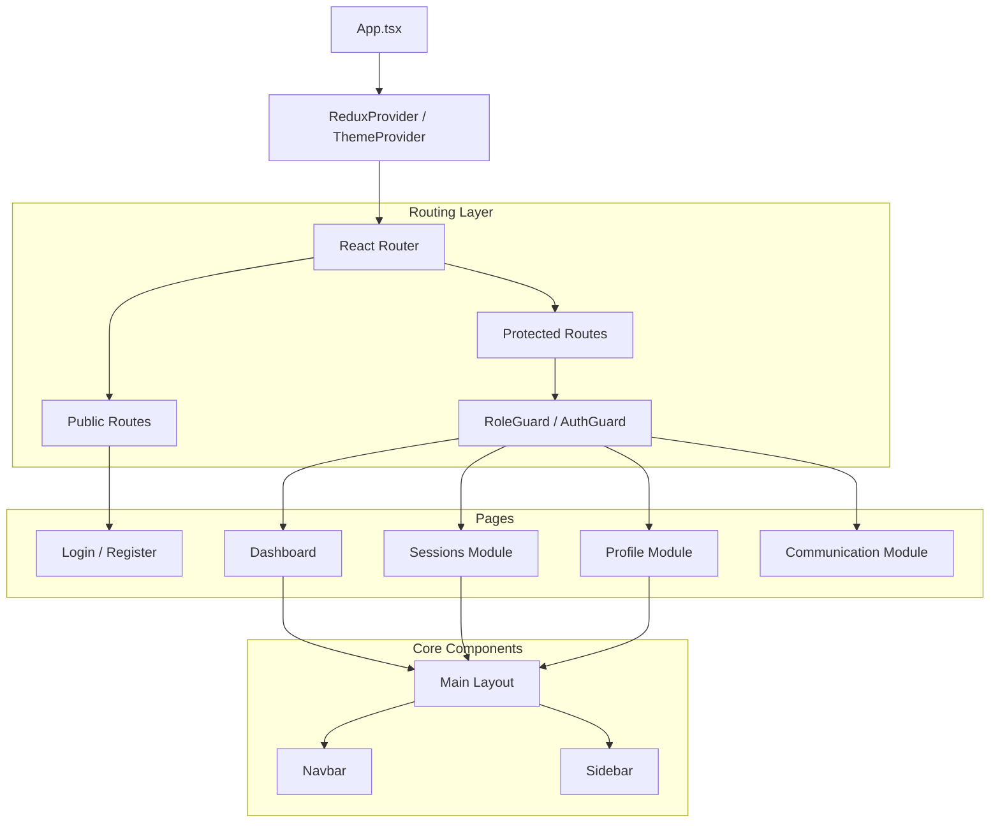
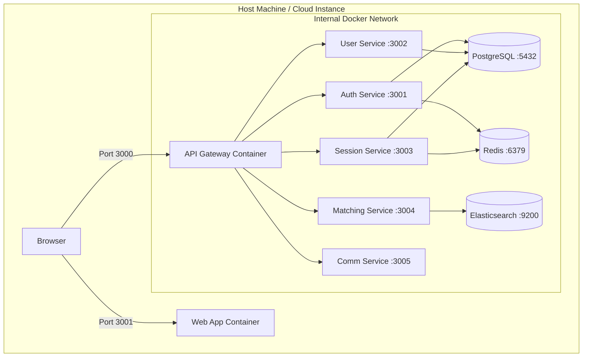

# 04. Frontend Architecture & Deployment Infrastructure

## 1. Frontend Architecture (Web App)

The **Web Application** is a Single Page Application (SPA) built with **React**, **TypeScript**, and **Vite**. It uses **Material UI** for components and **Redux Toolkit** for global state.

### Component Hierarchy



### Key Modules

| Module | Path | Description |
|--------|------|-------------|
| **Auth** | `src/pages/auth` | Login, Register, MFA Setup, Forgot Password. |
| **Sessions** | `src/pages/sessions` | List, Detail, Create, Edit, Join Session. |
| **Mentors** | `src/pages/mentors` | Mentor Discovery & Profiles. |
| **Communication**| `src/pages/communication`| Chat Interface & History. |
| **Store** | `src/store` | Redux Slices (`authSlice`, `sessionSlice`, `uiSlice`). |

## 2. Infrastructure & Deployment

The application uses **Docker** for containerization and **Docker Compose** for orchestration. Every microservice runs in its own container, sharing a common bridge network.

### Infrastructure Diagram



## 3. Deployment Instructions

### Local Development

The project includes a `deploy.sh` (or `.ps1` for Windows) helper script.

1. **Prerequisites**: Docker Desktop, Node.js v18+.
2. **Setup & Run**:

    ```bash
    # Installs dependencies & starts all containers
    npm run setup
    
    # Or manually:
    npm install
    npm run docker:up
    ```

3. **Access**:
    - Frontend: <http://localhost:3001>
    - API Gateway: <http://localhost:3000>

### Production Deployment

Production deployment uses `docker-compose.prod.yml` which likely includes stricter restart policies and resource limits (implied).

1. **Deploy Script**:

    ```bash
    # Deploy to Production environment
    ./scripts/deploy.sh production
    ```

    *This script builds optimized images, runs migrations, and starts services in detached mode.*

2. **Environment Variables**:
    Ensure `.env.production` is populated with real credentials (DB passwords, AWS Keys) before running the script.

### Database Migrations

Migrations are handled via the `scripts/migrate.sh` utility, which applies SQL files from `database/migrations` to the running Postgres container.

```bash
# Run migrations manually if needed
npm run migrate
```
